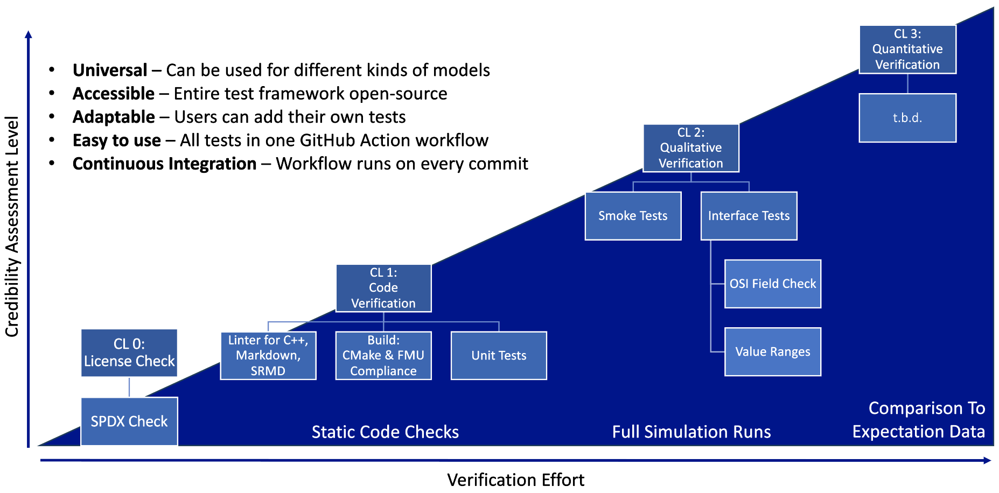
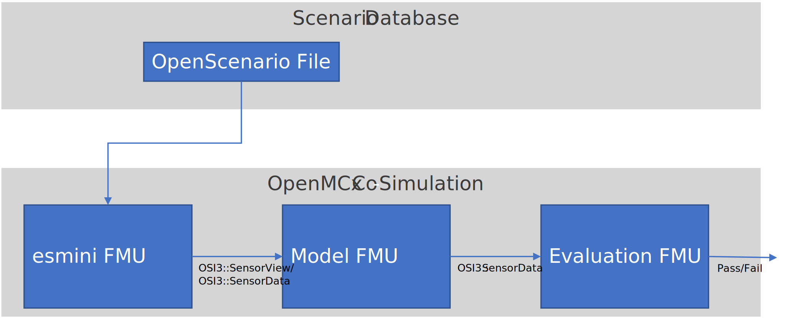
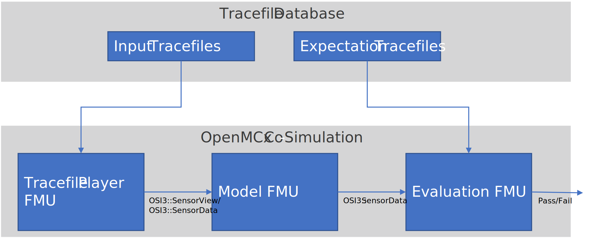

# OSMP Test Architecture

The OSMP Test Architecture is designed to test any simulation model complying to the [OSMP](https://github.com/OpenSimulationInterface/osi-sensor-model-packaging) specification.
A variety of model types from environmental effect models over sensor models to traffic participant models can be tested with this architecture.
The architecture is divided into 3 main test levels based on the credibility assessment level definition by Ahmann et al. [[1](#Ahmann2022)].
Because the test architecture is specifically designed for OpenMSL open source models, a license check is needed.
The license check is preceding the 3 main credibility assessment levels as level 0.
This yields the following credibility assessment level line-up:

- CL 0: [License Check](#cl-0-license-check)
- CL 1: [Code Verification](#cl-1-code-verification)
- CL 2: [Qualitative Verification](#cl-2-qualitative-verification)
- CL 3: [Quantitative Verification](#cl-3-quantitative-verification)

Every credibility assessment level is tested with a separate GitHub action and is further described in the following sections.

    
  <em>Discrete credibility assessment level</em>

## CL 0: License Check

For credibility assessment level 0 the software licenses are checked.
A GitHub Action checks every file containing code for an SPDX license identifier.
The identified licenses are verified against a list of approved open source licenses.
Approved licenses are: Apache-2.0, BSD-2-Clause, BSD-3-Clause, MIT, MPL-2.0.
Please contact the maintainers if you have other requirements regarding open source licenses.

An implementation of the GitHub action for this credibility assessment level can be found in the [sensor model template repository](https://github.com/openMSL/sl-1-0-sensor-model-repository-template/tree/main/.github/workflows/cl0.yml).

## CL 1: Code Verification

Credibility assessment level 1 contains multiple different tests for code quality.
In the first test, linters are used to ensure general quality of code and documentation.
In the example linked below, linters for C++ code, markdown files, and xml files such as SRMD and modelDescription are implemented.
Further linters have to be added, if additional programming languages are used.
In the second test, the model is build using cmake.
The third test category runs unit tests defined for the individual model.

An implementation of the GitHub action for this credibility assessment level can be found in the [sensor model template repository](https://github.com/openMSL/sl-1-0-sensor-model-repository-template/tree/main/.github/workflows/cl1.yml).

### CL 1.1: Linter

These tests consist of linters checking the formatting against style guides for code, markdown and xml.

#### C++ Linter

C++ code is checked with clang according to the clang-format and clang-tidy files in the repository.
It is mandatory for every code repository to provide these config files.
As a best practice, [clang-format-all](https://github.com/eklitzke/clang-format-all) can be used to automatically format all C++ files in the repository.
Be aware, that formatting might break functionality, e.g. by a different order of includes.
Be sure to check after formatting.

An implementation of the corresponding GitHub action can be found in the [sensor model template repository](https://github.com/openMSL/sl-1-0-sensor-model-repository-template/tree/main/.github/workflows/cpp-linter.yml).

#### Markdown Linter

Markdown files are checked by a markdown linter according to [these](https://github.com/DavidAnson/markdownlint/blob/main/doc/Rules.md) basic rules.

An implementation of the corresponding GitHub action can be found in the [sensor model template repository](https://github.com/openMSL/sl-1-0-sensor-model-repository-template/tree/main/.github/workflows/markdown.yml).
It also contains an example [markdownlint.json](https://github.com/openMSL/sl-1-0-sensor-model-repository-template/tree/main/.github/workflows/markdownlint.json) specifying variations of the applied rules.

#### SRMD Validator

Every model repository SHALL include an [SRMD file](https://pmsfit.github.io/SSPTraceability/master/#_srmd) conforming to the [SSP tracability](https://pmsfit.github.io/SSPTraceability/master/) process.
This file is checked against the [SRMD XML schema](https://github.com/PMSFIT/SSPTraceability).

### CL 1.2: Build

These tests check if the model can be build and the built FMU is compliant with the [FMI standard](https://github.com/modelica/fmi-standard).

#### Cmake

This test checks if cmake runs without errors and the model can be built with all necessary dependencies, such as OSI with Protobuf.

An implementation of the corresponding GitHub action can be found in the [sensor model template repository](https://github.com/openMSL/sl-1-0-sensor-model-repository-template/tree/main/.github/workflows/build.yml).

#### FMU Compliance Checker

The official [FMU Compliance Checker](https://github.com/modelica-tools/FMUComplianceChecker) by Modelica is used to check if the built FMU is compliant with the [FMI standard](https://github.com/modelica/fmi-standard).
This includes checking the binaries as well as included xml files such as the modelDescription.

Since the FMU Compliance Checker does not seem to be further maintained, [FMPy](https://github.com/CATIA-Systems/FMPy) is used as a second validation tool.

### CL 1.3 Unit Tests

Models SHALL include individual unit tests.
The tests SHALL be located in a folder _test/unit_ which MUST include the applied unit test library (e.g. [GoogleTest](https://github.com/google/googletest)).
Unit tests have to be custom to the implementation of the individual model.
Therefore, no standard unit tests are part of this test pipeline.

However, some examples can be found in the [sensor model template repository](https://github.com/openMSL/sl-1-0-sensor-model-repository-template/tree/main/test/unit).

## CL 2: Qualitative Verification

For credibility assessment level 2, the model is build and applied in a co-simulation.
[OpenMCx](https://github.com/eclipse/openmcx) is used as a co-simulation platform.
There are two possibilities for generating the input for the model.

1. The model input is provided by an OSI trace file.
   This trace file is read by an [OSI trace file player FMU](https://gitlab.com/persival-open-source/open-simulation-interface/osi-trace-file-player) which is connected to the model FMU.
   The connection interface is OSI with data according to the [model type](https://opensimulationinterface.github.io/osi-antora-generator/asamosi/latest/sensor-model/spec/model_types.html).
   In case of a sensor model, the connection interface is osi3::SensorView.
   For other models it can be osi3::SensorData, osi3::TrafficCommand etc.
   The co-simulation setup of this approach is depicted in the first image below.
2. The model input is provided by a scenario engine.
   The OpenScenario player [esmini](https://github.com/esmini/esmini) is used to play an OpenScenario file within an OSMP FMU and output osi3::SensorView data for the model.
   The co-simulation setup of this approach is depicted in the second image below.
   In a future adaptation, the esmini FMU will be enabled to receive osi3::TrafficCommand data to test further model types.

     
  <em>Test setups for credibility assessment level 2</em>

The output of the model can be used in three different ways:

1. It can be disregarded, just to test if the model runs at all. This is referred to as a smoke test. An example can be found [here](https://github.com/openMSL/sl-1-0-sensor-model-repository-template/tree/main/test/integration/001_smoke_test_tracefile).
2. It can be connected to a processing FMU evaluating the model output. This way, the model output is tested "on-the-fly" step by step during the co-simulation. This can for example be an interface test, e.g. [here](https://github.com/openMSL/sl-1-0-sensor-model-repository-template/tree/main/test/integration/003_output_osi_fields).
3. A [trace file writer](https://github.com/Persival-GmbH/osi-sensordata-trace-file-writer) can be used as a processing FMU to generate a trace file from the model output during the co-simulation.
This trace file will be supplied as a GitHub Action Artifact, so it can be downloaded for offline analysis.
But the trace file can also be directly analyzed in the pipeline by a python script.
This functionality is part of CL3.

All tests in CL 2 are considered integration tests, since they all require a co-simulation with at least one other FMU.
Therefore, every test is located in an individual folder in _test/integration_.
The individual test folder SHALL follow the naming scheme "xxx_short_description", where xxx is a three digit consecutive number.
The folder SHALL contain a [system structure definition file (.ssd)](https://ssp-standard.org/publications/SSP10RC1/SystemStructureAndParameterization10RC1.pdf).
In this file, the utilized model input (trace file player or esmini) as well as the processing FMU (evaluation or trace file writer) are specified.
The test folder SHALL additionally contain a README.md file, which describes the test system, scenario and pass/fail criterion.
A [template](integration_test_readme_template.md) is provided with the corresponding sections for this readme file.
Other simulation artefacts such as the trace file or scenario to be played as well as auxiliary files for the evaluation FMU and a python analysis script are also to be placed in that test folder.
Example implementations in the _test/integration_ folder can be found in the [sensor model template repository](https://github.com/openMSL/sl-1-0-sensor-model-repository-template/tree/main/test/integration/).

An implementation of the GitHub action for this credibility assessment level can also be found in the [sensor model template repository](https://github.com/openMSL/sl-1-0-sensor-model-repository-template/tree/main/.github/workflows/cl2.yml).

The three different test methods are described in more detail in the following sections.

### CL 2.1 Smoke Tests

Typically in software testing, smoke test are done by just running the system under test stand-alone.
But since OSMP models always require a model input, smoke test are also located in the integration test folder.
For the smoke tests, the model is employed in a co-simulation and fed with inputs.
The model is just connected either to a trace file player or a scenario engine to generate the model input.
The output of the model is not used.
The model SHALL go through the tests without any run time errors.

An example implementation of this test can be found in the [sensor model template repository](https://github.com/openMSL/sl-1-0-sensor-model-repository-template/tree/main/test/integration/001_smoke_test).

### CL 2.2 Interface Tests

In this test category, in addition to a trace file player or scenario engine, the model output is connected to an evaluation FMU.
With this setup, the model output is tested against various criteria.

#### OSI Field Check

In this test, the model output is connected to the [OSI Field Checker](https://github.com/openMSL/sl-1-5-sensor-model-testing/tree/main/src/osi-field-checker) FMU provided in this repository.
It checks, if the OSI fields required for the model under test are filled in the model output.
The required output fields are specified in a txt file, where every line is one OSI field.
If a field is missing in the output, it will be shown as an annotation in the GitHub action.
More detailed information about the OSI Field Checker can be found in the respective [Readme](https://github.com/openMSL/sl-1-5-sensor-model-testing/tree/main/src/osi-field-checker#readme).

An example implementation of this test can be found in the [sensor model template repository](https://github.com/openMSL/sl-1-0-sensor-model-repository-template/tree/main/test/integration/002_output_osi_fields).

#### Value Range Check

(not yet implemented)  
Furthermore, the value ranges of the output parameters are tested.
E.g. if a lidar sensor has intensity outputs in the interval [0, 100], the sensor model SHALL NOT output any values outside of this range.
These tests on value ranges might also include the timing of the model.
Additional test can be performed on the SensorViewConfigRequest during the initialization of the model FMU, if implemented.

## CL 3: Quantitative Verification

For credibility assessment level 3, the model is again employed in a co-simulation with a trace file player or scenario engine.
During the simulation, a trace file is generated containing the model output of every simulation time step.
This is done by connecting a [trace file writer](https://github.com/Persival-GmbH/osi-sensordata-trace-file-writer) to the model output in the SSP specification of the test.
The trace file writer is pre-built in every test environment.
The FMU is located at _/tmp/tracefile_writer_fmu/osi-sensordata-trace-file-writer.fmu_.
After the co-simulation is finished, the GitHub action scans the test folder for python files.
If it finds one, the python script is called with the path to the just generated trace file as an argument.
The file name of the python file does not matter.
However, if there is more than one python file in the directory, the analysis will not be performed since it is unclear, which file to use.
If supplementary files are necessary for the analysis, they are to be placed in a subfolder.

The purpose is to test the proper implementation of the model code in terms of its quantifiable requirements.
E.g. the sensor is rotated around all 3 axis, and it is evaluated, if the coordinate transformations in the model are correct.
This can be achieved in two ways:

1. The simulation trace file is analyzed by a custom standalone python script.
2. The simulation trace file is compared to an expectation trace file with a python script.

The general setup of this test level is depicted in the following image and both approaches are described in more detail in the following sections.

    
  <em>Test setup for credibility assessment level 3</em>

### CL 3.1 Standalone Trace File Analysis

The OSI trace file generated by the co-simulation is read in by a python script after the simulation has finished.
The python script can perform a variety of tests on the trace file, depending on the specific scenario and use-case.
For example, the scenario places an object at a certain distance inside the field of view of a sensor.
The python script can analyze the sensor model output and check, if the object was detected at the expected distance.
Another example would be to place an object outside of the field of view and check, that it was not detected.
Furthermore, distribution functions for detections or expected number of detections on an object can be checked.

An example implementation of this test can be found in the [sensor model template repository](https://github.com/openMSL/sl-1-0-sensor-model-repository-template/tree/main/test/integration/004_tracefile_analysis).

### CL 3.2 Trace File Comparison

(not yet implemented)  
This test is similar to 3.1.
But instead of analyzing the simulation trace file with certain criteria, the python script compares the model output to an expectation trace files.
The expectation trace file can either contain other simulated data or even measurement data from a real system to compare the model under test to.
This comparison is done with appropriate metrics.
Required thresholds for these metrics determine the pass/fail criterion of these tests.

## CL X: Validation

(not yet implemented)  
A future credibility assessment level might constitute the validation of the model against real world data.
In pre-defined validation scenarios, the model output is compared to measured sensor data with suitable metrics.
A similar test setup as in CL 3 might be applied.

## References

<a name="Ahmann2022">[1]</a> M. Ahmann, V. T. Le, F. Eichenseer, F. Steimann, and M. Benedikt, “Towards Continuous Simulation Credibility Assessment,” Proceedings of Asian Modelica Conference 2022, Tokyo, Japan, Nov. 2022.
